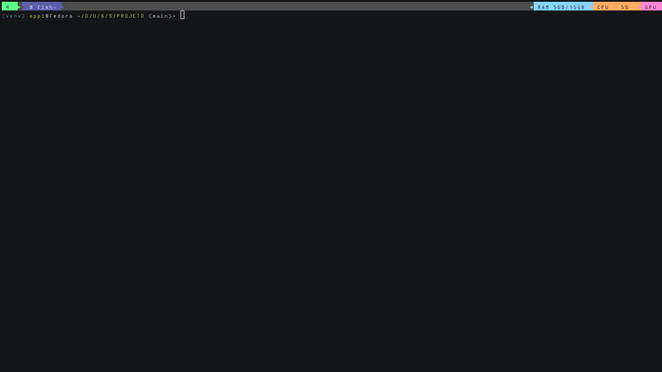

# A* search algorithm Project for University AI class
the objective of this project is to create an algorithm that uses a* to find a short solution for the maze while passing through all targets 

# How to run
clone the project
run main.py

# Extra configuration
- adding delay
    go in main.py and change the value in the sleep function

- changing the seed
    go in main.py and change the second argument of the class `Labirinto` (can be left empty for random seed)

- change map
    go in main.py and change the first argument of the class 'Labirinto'
    you can create custom maps by creating pbm files like following the format of the ones in the directory mapas
